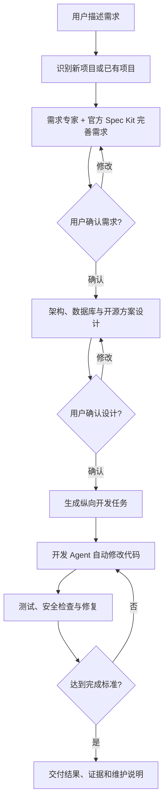

# DeepSeek Harness Backend Agent Team 设计文档

> 状态：已确认，冻结为实施基线  
> 设计确认日期：2026-08-25  
> 首发平台：macOS（Apple Silicon 与 Intel）  
> 产品形态：可安装的 DeepSeek Harness Bundle  
> 默认后端：Node.js + TypeScript + PostgreSQL

## 1. 结论摘要

Backend Agent Team 是安装到 DeepSeek Harness Profile 中的 Bundle。它面向不熟悉后端开发的用户，把自然语言需求转化为经过确认的需求说明、后端架构、数据库方案和可运行代码。

产品不 Fork DeepSeek Harness，也不重新实现 Spec Kit。它通过 DeepSeek Harness 的正式扩展机制注册插件能力，并直接调用官方开源 `specify-cli` 完成规格化工作。Backend Team 负责 Spec Kit 之外的流程编排、用户确认、专家协作、代码开发、安全边界、数据库运行、测试、恢复和交付。

V1 支持两种项目：

- 新项目：默认采用 Node.js、严格 TypeScript、NestJS + Fastify、PostgreSQL、Drizzle ORM 和 REST/OpenAPI。
- 已有 Node.js 项目：在原项目中直接增量修改，保留已有框架、ORM、数据库和包管理器；不会因为默认技术栈而强制迁移。

“已有项目直接修改”与“用户确认”不冲突。确认需求与确认设计是开始业务代码修改的前置条件；设计获批后，开发 Agent 会在已批准范围内自动修改代码，无须逐文件询问。安装依赖、数据库迁移、破坏性操作等仍受单独的安全门禁约束。

V1 不连接生产数据库、不执行生产部署、不默认使用 Docker，也不在系统全局安装 NVM、Node.js、npm 工具、Python、uv、PostgreSQL 或 DbGate。Team 管理的运行环境、缓存、状态和进程都位于对应项目的 `.backend-team/` 目录。

## 2. 产品目标与边界

### 2.1 目标

1. 让不熟悉后端开发的用户能够用自然语言完成后端功能。
2. 在写代码前补齐需求、业务规则、验收条件、架构和数据库设计。
3. 对新项目提供可靠默认值，对已有项目保持技术栈兼容。
4. 通过受控专家与子 Agent 提升分析和开发质量，同时避免无边界的 Agent 扩散。
5. 将所有重要决定、确认、迁移和测试证据持久化，使任务可恢复、可审计。
6. 优先使用维护良好的开源方案，并对许可证、安全性和替换成本负责。
7. 在无 Docker、无全局开发环境的前提下，提供工作区隔离的 PostgreSQL 和数据库可视化体验。

### 2.2 非目标

V1 不提供：

- Python、Java、Go 等非 Node.js 后端开发。
- 生产环境发布、生产数据库操作或云资源编排。
- 自动把 MySQL、SQLite 或其他数据库迁移到 PostgreSQL。
- 默认微服务拆分、Kubernetes 或容器编排。
- 自研数据库管理 GUI；DbGate 作为独立开源工具按需启动。
- 多组织、多人审批、计费和企业权限系统。
- 完全无人监督的高风险变更。
- Linux 与 Windows 的正式支持承诺；代码边界会为后续平台适配保留接口。

## 3. DeepSeek Harness 集成模型

### 3.1 官方术语

- **Plugin**：导出 `apply(ctx)` 的 TypeScript 模块，通过上下文注册能力。
- **Bundle**：一个 npm 包，通过 `package.json` 中的 `dsh.bundle` 指向 `cordis.patch.yml`，作为可安装的补丁/配置层启用一个或多个 Plugin。Bundle 并不以“必须有多个 Plugin”为定义。
- **Profile**：DeepSeek Harness 的运行配置目录，保存按顺序加载的 Bundle 列表和用户补丁。

Backend Agent Team 对外发布为一个预构建的 npm Bundle 包或 `.tgz` 文件。用户把它添加到指定 Profile 后即可使用。首发不以 Git 源码地址作为常规安装方式，避免包管理器因构建脚本策略导致安装失败。

### 3.2 集成原则

1. 不修改、Fork 或 Patch DeepSeek Harness 核心代码。
2. Stage 01 只把官方 rc.6 `ctx.tools.register(ToolDefinition): disposer` 和 `ctx.tools.guard(ToolGuard): disposer` 纳入 Harness 结构适配层；生产 Bundle 当前只使用 `register`，不安装全局 guard。
3. 业务编排依赖应用层 `BackendTeamOrchestrationPort`（`requestApproval`、`spawnAgent`、`emit`），不把这些方法伪装成已验证的 Harness Context API。Stage 04–06 只用 `MockBackendTeamOrchestrationPort` 验证应用行为，不注册生产 Bundle 动作。Stage 07 Task 2 明确拥有唯一生产实现：应用内持久事件端口负责事件落盘，经过认证的控制面审批端口负责用户决定，真实 Agent spawn/result/cancel/用量核算则必须先通过精确的公开官方 API/来源兼容门禁。rc.6 的 Approval、Agent spawn、事件、Session、安全凭据与可信运行时版本接口均未获得 Stage 01 证据；Mock 不构成宿主证据，任一生产缝缺失都硬阻断 Bundle E2E 与发布。
4. 兼容性证据分为两层：
   - 外部 Profile 兼容矩阵通过固定 `0.1.0-rc.6` 的 pack/add/dump、Cordis 启动和官方 `ctx.tools.execute` 验证安装与工具执行。
   - 官方 rc.6 Context 没有可信运行时版本字段，因此生产 Bundle 不使用兼容矩阵自我晋级；当前始终报告 `version: "unknown"`、`mode: "read-only"`、`evidenceStatus: "unknown"`，只注册 `backend_team_status`。
   - 后续宿主能力缺少新的官方兼容证据时继续保持只读诊断，禁止写代码和迁移；Mock 只验证应用逻辑，不证明宿主支持。
5. 实时 UI 将来可消费应用层持久事件投影，但不得假定 rc.6 已提供 Harness 会话事件接口；项目内状态文件始终负责跨会话恢复。

### 3.3 Bundle 内部模块

建议以 TypeScript monorepo 组织：

```text
packages/
  bundle/                 # npm 发布入口、dsh.bundle、cordis.patch.yml
  core/                   # 状态机、协调器、审批、预算、恢复
  harness-adapter/        # DeepSeek Harness 兼容层
  spec-workflow/          # 官方 Spec Kit CLI 适配与产物校验
  project-analyzer/       # 新/旧项目识别与技术栈画像
  agent-team/             # 专家定义、委派协议、结果合成
  policy-engine/          # 工具权限、路径边界、风险门禁
  database/               # PostgreSQL 生命周期、迁移、DbGate
  platform-macos/         # 进程、路径、下载、权限、架构差异
  web/                    # DeepSeek Harness 内的简化控制面板
  contracts/              # 状态、事件、任务、审批等共享 Schema
presets/                  # Agent 与工作流预设
templates/                # Spec Kit 扩展模板、报告模板
tests/                    # Bundle 集成、故障恢复与端到端测试
```

内部可以合并包以降低首版维护成本，但上述模块边界必须保留，尤其不能把平台操作、Harness API 和流程状态混进 Agent 提示词。

## 4. 用户主流程



### 4.1 第一次确认：需求

需求专家使用用户能理解的语言确认：

- 谁会使用、要解决什么问题。
- 主要业务流程、异常流程和边界情况。
- 业务规则、权限和数据可见范围。
- 需要保存的数据、敏感信息和保留期限。
- 外部系统、回调、邮件、支付等集成。
- 性能、可靠性、审计和安全要求。
- 明确不做的内容。
- 可验证的验收条件。

需求确认只授权进入设计阶段，不授权修改业务代码。

### 4.2 第二次确认：架构与数据库方案

架构专家、数据库专家和开源方案研究专家协作产出：

- 系统边界、模块职责和请求流程。
- API 契约、认证和权限模型。
- 数据表、字段、类型、约束、索引、关系和生命周期。
- 迁移策略、兼容策略和回滚方式。
- 关键开源依赖的选择理由与风险。
- 测试策略、观测方式和已知限制。

用户确认后，需求与设计文件的内容哈希被记录。开发阶段在这一边界内自动修改代码。若后续发生实质性设计变化，对应审批和下游产物自动失效，流程退回合适阶段重新确认。

### 4.3 开发与交付

规划专家把设计拆成可独立验证的纵向切片，每个切片尽量同时包含 API、业务逻辑、数据访问、迁移和测试。开发期间只有以下情况打断用户：

- 需求存在无法从已确认内容推导的关键歧义。
- 需要新增依赖、共享配置或数据库迁移审批。
- 发现数据丢失、生产连接、真实密钥或工作区外写入风险。
- 现有代码与已确认设计发生实质冲突。

最终交付说明包含：已实现与未实现内容、API 文档、数据库迁移状态、测试与安全结果、启动和维护方法、现有基线问题、已知限制。

## 5. 新项目与已有项目策略

### 5.1 项目识别

项目分析器读取但不执行项目文件，形成 `project-profile.json`：

- Node.js 和 TypeScript 版本要求，以及 `.nvmrc`、`.node-version`、`package.json#engines`/`devEngines` 等版本声明的来源、冲突和置信度。
- 框架、HTTP 服务器、ORM/查询层和数据库。
- 包管理器与锁文件。
- 模块组织、测试框架、代码规范和构建命令。
- 迁移目录、环境变量约定和启动方式。
- Git 工作区状态、现有失败和高风险目录。
- 分析结论的证据与置信度。

低置信度结论不能作为自动写入依据；协调器必须先请求专家复核或向用户说明缺失信息。

### 5.2 决策矩阵

| 项目情况 | 行为 |
|---|---|
| 空目录或明确的新项目 | 使用默认 Node.js + PostgreSQL 技术基线 |
| 已有 Node.js + PostgreSQL | 保留框架和 ORM，在原项目增量开发 |
| 已有 Node.js + MySQL/SQLite/其他数据库 | 保留原数据库与迁移体系，不自动切换 PostgreSQL |
| 已有 Node.js，但结构不熟悉 | 先只读分析，达到置信度门槛后再制定修改方案 |
| 非 Node.js 后端 | V1 只读说明不支持，不修改业务代码 |
| 混合仓库/monorepo | 只操作用户指定或分析确认的 Node.js 服务边界 |

任何 Node.js 项目都可以进入需求和分析流程，但“支持”不等于不受约束地改代码。只有需求、设计已确认且项目画像可信时，开发 Agent 才能在任务范围内原地修改。

### 5.3 保护已有项目

- 不覆盖用户未提交修改，不执行重置或清理用户工作区的命令。
- 先记录现有测试、类型检查、构建和安全问题，后续区分“已有失败”与“本次新增失败”。
- 遵循已有包管理器、代码风格、目录和迁移工具。
- 已有 Node.js 项目优先使用其可信版本声明中与项目依赖、包管理器和当前平台兼容的精确 Node 版本；不因新项目默认值而强制迁移到 Node.js 24.19.0。多个声明冲突或没有可信声明时，在设计确认中确定并记录精确版本后才能执行项目命令。
- 不因为新项目默认值而替换 Express、Fastify、Koa、NestJS、Prisma、TypeORM、Sequelize、Knex 等现有方案。
- 共享文件、依赖清单和迁移目录采用独占锁，避免多个写 Agent 同时修改。

## 6. 官方 Spec Kit 集成

### 6.1 职责边界

直接使用 GitHub 官方开源 `specify-cli`，不复制其工作流，也不自行实现一个同名替代品。

Spec Kit 负责：规格化需求、澄清、规划、任务拆分及其标准产物。Backend Team 负责：

- 调用时机和参数。
- 与 DeepSeek Harness 会话和 Agent Team 的衔接。
- 两次用户确认及内容哈希。
- 后端架构、数据库、安全和测试扩展产物。
- 项目写入策略、工具权限和运行环境。
- 开发执行、验证、故障恢复和最终交付。

### 6.2 产物约定

```text
.specify/                         # 官方 Spec Kit 配置、模板和脚本
specs/<feature-id>/
  spec.md                         # 需求规格
  clarification.md                # Backend Team 的确认摘要与未决项
  plan.md                         # Spec Kit 实施方案入口
  research.md                     # 需要时生成的研究记录
  architecture.md                 # 后端架构详细设计
  data-model.md                   # 数据模型
  contracts/openapi.yaml          # API 契约
  quickstart.md                   # 本地验证说明
  tasks.md                        # 可执行任务
  test-plan.md                    # 验收条件到证据的映射
  decisions.md                    # 决策、替代方案与变更历史
```

`SpecKitAdapter` 负责：

1. 固定并检查 `specify-cli` 版本。
2. 设置工作区内 uv、Python、工具和缓存路径。
3. 只调用公开 CLI，不依赖内部 Python 模块。
4. 解析退出码和产物，不把自然语言控制台输出当成唯一成功依据。
5. 对标准产物与 Backend Team 扩展产物分别校验，避免覆盖官方模板。
6. CLI 不可用时清晰失败，不静默回退到“伪 Spec Kit”。

## 7. Agent Team 组织与权限

### 7.1 拓扑

采用受控两级委派：

```text
协调器（唯一用户出口与状态写入者）
  └─ 专家 Agent（按需创建）
       └─ 工作子 Agent（按需创建，不能继续创建 Agent）
```

- 协调器可以创建专家。
- 专家可在收到的任务授权中创建工作子 Agent。
- 工作子 Agent 没有创建 Agent 的权限。
- 子 Agent 的工具、路径、预算和风险权限不得超过父任务。
- 子 Agent 不能确认阶段、改变用户审批、宣布全局完成或直接代表 Team 交付。
- 父 Agent 必须验证并合成子 Agent 的结果，不能仅转发其结论。

### 7.2 专家角色

| 角色 | 主要职责 | 写入权限 |
|---|---|---|
| 协调器 | 状态机、上下文、审批、预算、用户沟通 | 仅状态与编排产物；统一提交阶段变更 |
| 需求专家 | 需求澄清、验收条件、非目标 | 仅规格文档 |
| 项目分析专家 | 识别现有架构、风险和基线 | 只读 |
| 开源方案研究专家 | 依赖比较、许可证、维护和安全评估 | 仅研究/决策文档 |
| 后端架构专家 | 模块、API、鉴权、集成设计 | 仅设计文档 |
| 数据库专家 | 表、约束、索引、迁移和数据生命周期 | 设计阶段仅文档；开发阶段迁移须单独授权 |
| 规划专家 | 纵向切片、依赖和完成条件 | 仅计划与任务文档 |
| 开发专家 | 在批准范围内实现业务代码和测试 | 分配范围内可写 |
| 测试专家 | 验证需求和回归，补充/修复测试 | 仅测试代码和测试产物，不改实现 |
| 安全专家 | 依赖、密钥、注入、认证和权限审查 | 只读与报告 |
| 修复专家 | 根据失败证据修复实现 | 明确分配范围内可写 |

### 7.3 委派协议

每个 Agent 任务必须是自包含的，至少包括：

- 目标与明确非目标。
- 可读/可写路径和文件所有权。
- 可用工具与禁止操作。
- 输入产物及其内容哈希。
- 时间、Token、工具调用和重试预算。
- 完成标准、验证命令和返回格式。
- 必须附带的证据。

多个 Agent 可以并行只读分析。写入并行仅限互不重叠的文件；依赖清单、共享类型、公共配置和迁移必须串行。

## 8. 状态机、审批与恢复

### 8.1 阶段状态机

```text
DISCOVER
  -> SPECIFY
  -> AWAIT_REQUIREMENTS_APPROVAL
  -> DESIGN
  -> AWAIT_DESIGN_APPROVAL
  -> PLAN
  -> BUILD
  -> VERIFY
  -> DELIVER
```

任务运行状态独立记录为：

```text
running -> passed | failed | blocked | interrupted
```

只有协调器可以改变全局阶段。阶段推进需要通过状态 Schema 校验、前置产物校验和审批哈希校验。

### 8.2 持久化目录

```text
.backend-team/
  state/                 # 版本化状态、审批、阶段和检查点
  project-profile.json   # 项目识别结论与证据
  runs/                  # Agent 任务、结果、验证和审计日志
  locks/                 # 文件组、迁移和运行时独占锁
  handoff/               # 父子 Agent 的结构化交接
  runtime/               # uv、Python、Spec Kit、PostgreSQL、DbGate
  cache/                 # 下载与工具缓存
  logs/                  # 本地服务日志，经过脱敏
```

`.backend-team/runtime/`、`cache/`、`logs/`、临时锁和敏感状态默认加入 `.gitignore`。需要协作或审计的非敏感状态可由用户选择提交；规格文档默认可版本控制。

### 8.3 审批失效

审批记录包含：审批类型、目标文件列表、规范化内容哈希、时间和对应阶段。以下情况自动失效：

- 已审批文件内容变化。
- 项目关键技术栈、数据库或迁移基线变化。
- Git 工作区出现与设计冲突的外部修改。
- 上游需求审批失效。

格式化或无语义变化是否失效，由稳定规范化规则决定；无法可靠判断时按失效处理，不猜测用户意图。

### 8.4 中断恢复

重启或恢复时依次检查：

1. 状态 Schema 版本与兼容迁移。
2. 规格和审批哈希。
3. Git HEAD、用户未提交修改和 Agent 自己的补丁边界。
4. 数据库运行状态和已应用迁移。
5. 过期锁、孤立进程和未完成 Agent。
6. 最后一个已验证检查点。

无法证明成功的 `running` 任务标记为 `interrupted`，不会直接视为完成。只清理 Team 创建且身份可验证的孤立进程/锁，不终止用户进程。

## 9. 工作区隔离运行环境

### 9.1 隔离边界

Backend Team 管理的内容必须位于当前项目：

```text
.backend-team/runtime/bin/uv
.backend-team/runtime/nvm/        # 产品本地 NVM loader 与受审的精确 Node/npm 安装
.backend-team/runtime/python/
.backend-team/runtime/spec-kit/.venv/
.backend-team/runtime/uv-tools/
.backend-team/runtime/postgresql/
.backend-team/runtime/dbgate/
.backend-team/cache/uv/
.backend-team/cache/nvm/
.backend-team/cache/downloads/
```

允许位于项目之外、但不由 Team 安装或修改的产品基础设施仅包括 DeepSeek Harness、Git 和操作系统安全凭据服务。Stage 01 当前仓库开发可例外只读 source 用户已有 NVM loader，但产品项目命令禁止加载任何 host/user-global NVM。Backend Team 发起的所有产品 `node`、`npm`、`npx` 子进程都必须由目标项目 `.backend-team/runtime/nvm/nvm.sh` 选择同目录下的精确 Node 安装。Team 不修改外部 NVM、shell 配置或 global default/alias，不新增系统服务，也不写全局 Node/npm/Python/uv/PostgreSQL 目录。

### 9.2 NVM 与 Node.js

- 目标项目 `.backend-team/runtime/nvm` 保存经过验证的 NVM loader、选定的精确 Node/npm/npx 安装和下载缓存。产品执行只允许 source 该目录的 `nvm.sh`；不得加载用户/host NVM，也不得使用系统/Homebrew/MacPorts Node 或 PATH 中的 npm/npx。
- 当前 Stage 01 开发证据只证明：现有用户 NVM loader（脱敏路径 `<existing-user-nvm>/nvm.sh`，NVM `0.40.3`）被只读 source，而 `NVM_DIR`、Node.js `24.19.0` 和 npm `11.17.0` 位于工作树 `.backend-team/runtime/nvm`。它不证明独立的 workspace-local NVM bootstrap 已实现。
- Stage 02 先建立 policy-engine-owned 的一次性安装会话：用户确认的完整安装计划绑定版本、来源、许可证、字节数、SHA-256、目标、网络主机和精确命令；Token 只消费一次，下载与命令能力仅在一次回调内可用，并在退出时撤销。只有在该会话通过 exact-scope、重定向、命令身份和撤销测试后，平台下载适配器才可公开给后续安装器复用。
- 产品级 `WorkspaceNodeRuntime`、产品本地 bootstrap、NVM/Node manifest catalog/resolver 和隔离测试由 Stage 05 Task 2 在首个项目命令之前实现。Bootstrap 必须复用 Stage 02 的受控安装会话与平台下载适配器，按受审 manifest 获取 NVM source，验证来源、SHA-256、体积和许可证后安装到目标项目；未完成时 Stage 05 执行和 Stage 07 发布都硬阻断。
- NVM/bootstrap 或新 Node 版本的首次下载/安装必须走现有安装许可门禁，显示精确版本、来源、哈希、体积和目标路径；不执行远程 `curl | sh`，不修改 `.zshrc`、`.bashrc`、`.profile`，不创建或修改全局 `nvm alias default`。
- Runtime manager 只选择绝对 `node`/`npm`/`npx` 路径。pnpm/yarn 必须是受审的项目本地绝对可执行文件，或由选定的绝对 Node 调用的项目本地 JavaScript entry；禁止 PATH 查找和用户输入 shell 拼接。
- Backend Team 自身的控制/构建基线与新项目固定使用 Node.js `24.19.0`。该版本与 Stage 01 已验证环境一致；只有受审兼容矩阵更新才能改变新项目默认值。
- 已有 Node.js 项目优先遵守可信的 `.nvmrc`、`.node-version`、`package.json#engines`/`devEngines` 等声明，选择满足声明且与项目工具链兼容的精确版本，并安装到同一目标项目的 NVM 目录。不会强制迁移到 `24.19.0`；声明冲突或缺失时必须在设计确认中确定版本。每个获批精确版本必须按 macOS 架构命中受审 manifest；无匹配项时在下载和命令之前失败关闭，禁止动态拼 URL 或校验和。
- 产品运行时每次执行记录本地 loader manifest/hash、精确 Node/npm/npx 版本、macOS 架构、绝对二进制 realpath 和选择依据。Team 发起的裸 `node`/`npm`/`npx` PATH 查找一律拒绝。

### 9.3 uv 与 Python

所有 Python 环境无条件使用 `uv` 管理。启动 Spec Kit 时设置至少以下路径：

```text
UV_PROJECT_ENVIRONMENT=.backend-team/runtime/spec-kit/.venv
UV_CACHE_DIR=.backend-team/cache/uv
UV_PYTHON_INSTALL_DIR=.backend-team/runtime/python
UV_TOOL_DIR=.backend-team/runtime/uv-tools
UV_TOOL_BIN_DIR=.backend-team/runtime/bin
UV_NO_SYSTEM_CONFIG=1
```

如果工作区没有 uv，必须先向用户请求安装许可，再使用 workspace-local 的 unmanaged 安装方式；不修改系统 PATH，也不启用自更新。如果缺少可用 Python，同样先请求许可，再由 workspace-local uv 下载并管理对应 Python。不能调用或安装主机全局 Python 来绕过这一步。

### 9.4 PostgreSQL

V1 使用按需启动的真实 PostgreSQL 服务，不用 Docker，不注册 macOS 系统服务：

- PostgreSQL 二进制、数据目录、Unix socket、端口记录和日志均在 `.backend-team/`。
- 每个工作区拥有独立实例；默认仅监听 loopback 或工作区 Unix socket。
- 首次使用前展示版本、来源、体积、许可证和校验信息，并请求下载/安装许可。
- 发布物按 Intel/Apple Silicon 提供固定版本、校验和与来源清单；具体可移植二进制供应方式需在实施第一阶段完成可重复性验证。
- 启停采用短生命周期进程，不设置开机自启；空闲时可停止以减少内存占用。
- 密码、连接串和临时凭据不写入规格文档或 Agent 提示词；日志必须脱敏。
- PGlite 等兼容实现可以用于低成本单元场景，但不能替代最终的真实 PostgreSQL 集成和迁移测试。

### 9.5 DbGate

DbGate Community 作为默认数据库可视化工具，按需以独立本地进程启动，而不是嵌入或复制其源码。选择理由：开源、支持 PostgreSQL、可查看和编辑数据，并支持以图形方式创建表、字段、主键、外键和索引。

使用规则：

- DbGate 运行文件和配置在 `.backend-team/runtime/dbgate/`，仅绑定本机。
- 启动前由 Team 注入当前工作区数据库连接，用户不需要复制密码。
- 浏览和编辑普通测试数据可以直接执行。
- 表、字段、索引和关系等结构变化不能只停留在 GUI 中。
- 用户在 DbGate 设计结构后，先查看 SQL 预览；Backend Team 将变化同步到 Drizzle Schema，生成可审阅迁移，完成真实 PostgreSQL 测试，经迁移门禁后再应用。
- 发布前审查 DbGate GPL-3.0 的独立分发、许可证告知和源码获取义务。若分发模式不满足要求，则改为由用户单独安装/启动，不把其打入 Bundle。

轻量只读场景可选 pgweb；高级外部工具可使用 pgAdmin 或 DBeaver，但它们不是 V1 默认依赖。

## 10. 新项目默认技术基线

默认值只适用于新项目，且在创建时记录固定版本和锁文件：

- Node.js `24.19.0`，由目标项目 `.backend-team/runtime/nvm` 内的 NVM 环境提供；除非受审兼容矩阵后续更新，否则新项目不漂移到其他版本。
- 严格模式 TypeScript。
- 模块化单体架构，除非需求证明确需微服务。
- NestJS + Fastify adapter。
- REST + OpenAPI；GraphQL、WebSocket 或 RPC 只在需求明确时采用。
- PostgreSQL。
- Drizzle ORM + `pg` 驱动。
- 可审阅 SQL 迁移；正式环境模型中不使用直接 schema push 代替迁移历史。
- 真实 PostgreSQL 集成测试。
- 原生工作区运行，不默认生成 Docker 依赖。

默认架构强调清晰模块边界，使未来拆分服务成为可能，但不预付微服务复杂度。

## 11. 数据库设计与迁移规则

数据库设计必须覆盖：

- 表和字段的业务含义，而不仅是技术命名。
- 数据类型、是否为空、默认值、唯一性和检查约束。
- 主键、外键、删除/更新行为。
- 查询模式对应的索引及其写入成本。
- 时间、金额、时区、枚举和 JSON 的使用理由。
- 权限隔离、软删除、审计、数据保留和敏感字段处理。
- 初始数据、数据迁移、回滚和向后兼容。

迁移流程：

```text
设计变化
  -> 更新 data-model / Drizzle Schema
  -> 生成 SQL migration
  -> 人工/Agent 差异审查
  -> 空库验证
  -> 现有版本升级验证
  -> 安全回滚或前向修复验证
  -> 用户确认高风险迁移
  -> 只应用到当前工作区 PostgreSQL
```

删除列/表、收窄类型、重写大表、不可逆数据变换等必须进入高风险门禁。执行前创建工作区本地快照，并明确说明快照不能替代正式备份。V1 永远拒绝生产数据库目标。

## 12. 工具权限与安全边界

### 12.1 默认动作等级

**自动允许：**

- 读取、搜索和分析批准的工作区文件。
- 运行已知的本地测试、类型检查、构建、lint 和格式化命令。
- 在 Agent 被分配且已获设计批准的文件范围内修改代码。

**执行前确认：**

- 下载或安装 workspace-local 的 NVM、Node.js、uv、Python、Spec Kit、PostgreSQL、DbGate 等工具，或新增 Node.js 项目依赖。
- 运行新发现或无法证明安全的脚本。
- 修改共享配置、依赖清单和迁移。
- 需要网络访问、较大磁盘占用或较长后台进程的操作。

**始终拒绝：**

- 连接或修改生产数据库、执行生产部署。
- 使用真实生产密钥或把密钥发给模型/子 Agent。
- 写入工作区外路径、修改系统配置或全局安装开发工具。
- 破坏性 Git 操作、清除用户未提交修改。
- 未经验证的递归删除、任意脚本执行和权限提升。

### 12.2 强制执行

Agent 提示词、工具可见性和 Harness guard 都不是权威安全边界。所有关键规则必须由 Policy Engine 在真正执行写文件、进程、网络或数据库副作用的适配器中立即重新授权：规范化真实路径、防符号链接逃逸、命令分类、网络目标、数据库连接目标、进程归属和审批 Token。子 Agent 只能获得缩小后的工具集合和路径范围；Stage 01 生产 Bundle 不安装全局 guard。

### 12.3 密钥与隐私

- 优先通过注入的安全凭据端口使用 macOS Keychain 保存真实凭据引用。不得宣称 rc.6 已验证 DeepSeek Harness 安全凭据 API；若未来接入宿主凭据能力，必须先通过新的官方 API/来源兼容门禁。
- 状态、日志、Handoff 和提示词中只出现脱敏值或凭据标识符。
- 默认不上传项目代码、数据库内容、遥测和使用数据到第三方。
- 测试数据优先合成；若用户导入真实数据，必须先说明范围和风险。

## 13. 开源依赖治理

选择顺序：已有能力 > 维护良好的开源依赖 > 自建小型适配 > 经用户确认的闭源/付费方案。

每个新增依赖记录：

- 用途和不用它的代价。
- 至少一个可行替代方案。
- 许可证和传递依赖许可证。
- 维护活跃度、发布稳定性和项目治理。
- 已知漏洞、供应链风险、生命周期脚本和遥测。
- 版本固定、升级策略和未来替换路径。

许可证策略：

- MIT、Apache-2.0、BSD、ISC、PostgreSQL License 等宽松许可证可进入常规审查。
- GPL、AGPL、SSPL 或未知许可证必须专项审查分发和网络使用影响。
- 无法确认许可证的依赖禁止加入。

依赖使用锁文件和精确/受控版本范围，不随手批量升级。首次安装默认禁用或审查生命周期脚本；生成 SBOM，并至少结合两个漏洞信息来源。存在严重且无修复漏洞的新依赖不能采用；已有项目风险单独报告，不以无关大改掩盖。

## 14. 测试与完成标准

### 14.1 业务项目验证

按项目适用性执行：

- TypeScript 严格类型检查、lint、build。
- 领域和业务规则单元测试。
- 真实 PostgreSQL 集成测试。
- API、认证、权限和越权测试。
- OpenAPI 契约一致性测试。
- 迁移空库、版本升级及安全回滚/前向修复测试。
- 启动、健康检查、优雅关闭和异常恢复。
- 依赖、密钥、注入、认证和授权安全检查。

每条验收条件映射到明确证据，结果只能是 `passed`、`failed`、`not-run` 或 `blocked`，不能用“应该可以”。每个纵向切片先局部验证，全部切片完成后运行完整回归。测试专家不得通过修改业务实现来让测试通过；失败交由修复专家处理，然后重跑受影响范围和最终回归。

已有项目先记录基线，完成标准是“不新增失败”并通过本次需求相关验证；不要求顺便修复所有历史问题。

### 14.2 Bundle 自身验证

- 状态转换和非法阶段阻断。
- 两次审批、哈希失效和下游产物失效。
- 中断恢复、状态升级、过期锁和孤立进程处理。
- 专家/子 Agent 层级、并发、预算和工具降权。
- 文件所有权、共享资源串行和符号链接逃逸阻断。
- 生产连接、工作区外写入和破坏性命令阻断。
- Spec Kit、PostgreSQL、DbGate 不可用时的正确降级。
- Apple Silicon 与 Intel macOS 安装、启动、停止和卸载。
- DeepSeek Harness Web UI 的完整端到端测试必须使用 Codex Chrome 插件完成。

## 15. 失败处理、重试与回滚

失败按类型记录：需求矛盾、权限拒绝、依赖/网络、工具缺失、代码失败、测试失败、迁移风险、资源超限、Harness 不兼容和外部中断。

- 可恢复的瞬时错误最多自动重试 2 次，并使用退避。
- 权限拒绝、需求矛盾、数据风险和确定性代码失败不盲目重试。
- 每个写任务保留 Agent 自己的补丁边界和验证检查点。
- 回滚只回滚 Team 能证明属于自己的修改，不覆盖用户更改。
- 共享文件冲突时停止自动合并，由父 Agent 重新读取和重组。
- 迁移前创建本地快照；不可逆迁移失败时停止并报告，不伪造成功。
- 子 Agent 的结果必须持久化到 Handoff，直到父 Agent 已确认接收。
- DeepSeek Harness 不兼容时进入只读模式，输出诊断和支持范围。

## 16. 资源与并发预算

默认上限：

- Agent 深度最多 2 层：协调器 → 专家 → 工作子 Agent。
- 同时运行专家最多 3 个。
- 每个专家最多创建 3 个工作子 Agent。
- 全局同时写代码的 Agent 最多 2 个。
- 只读分析可并行；共享资源始终独占。

协调器按任务复杂度选择执行模式：

- 简单：协调器 + 1 个合适专家。
- 标准：需求/设计后由 1–2 个开发或测试专家执行。
- 复杂：最多 3 个专家并行，专家可有限创建子 Agent。
- 高风险：减少并发，增加只读复核和用户门禁。

每项任务有 Token、时间、工具调用和重试预算。达到预算时停止新增 Agent，保留已完成证据并向用户说明阻塞，不通过无限委派掩盖问题。UI 显示当前阶段、专家任务、复杂度、资源消耗、风险和阻塞原因。

## 17. Web 控制面板

V1 提供面向非技术用户的简化面板，核心内容包括：

- 当前处于“完善需求、等待确认、设计、开发、测试、交付”中的哪一步。
- 待确认内容的通俗摘要和“查看详细文档”入口。
- 正在工作的专家、任务和是否发生阻塞。
- 本次修改范围、数据库变化和高风险提示。
- 测试结果、已有项目基线问题和最终交付证据。
- PostgreSQL 启停、DbGate 打开和本地资源占用。
- 预算使用和剩余空间。

面板不能成为唯一状态源；刷新、关闭或 Harness 重启后必须从 `.backend-team/state/` 恢复。

## 18. macOS 首发与跨平台边界

V1 同时验证 Apple Silicon 和 Intel macOS。平台适配层负责：

- CPU 架构与可执行文件选择。
- 路径、权限、进程、端口、Unix socket 和文件锁。
- 下载校验、隔离属性、代码签名/公证兼容。
- NVM、Node.js、uv、Python、PostgreSQL 和 DbGate 的安装与生命周期。
- Bash 环境和浏览器打开方式。

核心状态机、Agent 协议、产物 Schema 和 Policy Engine 不包含 macOS 专用路径。Linux/Windows 后续通过独立适配器接入；在通过各自安装、权限、进程、Shell 和 E2E 验证前，不宣称正式支持。

## 19. V1 功能范围

### 19.1 包含

- 可安装的 DeepSeek Harness Bundle 与兼容检查。
- 工作区内 NVM、Node.js、uv、Python、官方 Spec Kit、PostgreSQL 和 DbGate 管理。
- 官方 Spec Kit 的需求、澄清、计划和任务流程。
- 新项目/已有 Node.js 项目识别。
- 新项目默认技术栈和已有项目原地增量开发。
- 协调器、按需专家和受控两级子 Agent。
- 需求确认与架构/数据库确认。
- 文件所有权、锁、工具守卫和审批失效。
- PostgreSQL Schema、迁移与 DbGate 可视化流程。
- 测试、安全、失败恢复和跨会话恢复。
- 简化 Web 控制面板。

### 19.2 不包含

- Linux/Windows 正式发布。
- 生产部署或生产数据库。
- 云端/远程开发服务器管理。
- MySQL 到 PostgreSQL 自动迁移。
- 非 Node.js 后端。
- 自研数据库 GUI。
- 多用户组织功能。
- 默认微服务。
- 无监督生产操作。

## 20. 七个实施阶段

### 阶段 1：Harness 与发布基础

- 建立只依赖官方 `ctx.tools` 的 Bundle、Plugin 注册、Profile 安装和 tools-only Harness 适配层。
- 建立 monorepo、共享 Schema、外部兼容矩阵和只读降级；生产报告不得从矩阵推断运行时版本或自动解锁写能力。
- 记录当前 Stage 01 开发环境的真实边界：现有 NVM `0.40.3` loader 只读、工作树本地 `NVM_DIR`、Node.js `24.19.0`/npm `11.17.0`；不把它描述为独立产品 bootstrap。
- 验证 macOS 双架构的 workspace-local 下载、校验和进程模型。
- 对 PostgreSQL 可移植二进制供应方式完成技术与许可证 Spike；不通过则不能进入数据库开发。

### 阶段 2：Spec Kit 工作流

- 建立 workspace-local uv/Python/`specify-cli` 管理。
- 接入官方 CLI，校验标准产物和扩展模板。
- 完成需求确认、设计确认、内容哈希与失效机制。

### 阶段 3：项目理解

- 完成新/旧项目分类、技术栈画像、置信度和 Git 基线。
- 支持 monorepo 服务边界和现有失败记录。
- 建立新项目默认模板，但不把模板强加给已有项目。

### 阶段 4：Agent Team

- 实现协调器、专家角色、两级委派和结构化 Handoff。
- 实现路径所有权、工具降权、并发与预算。
- 通过应用层 `BackendTeamOrchestrationPort` 与 Mock 验证专家可创建子 Agent，但子 Agent 不能继续委派或改变阶段；此阶段不宣称生产 Harness Agent 绑定。

### 阶段 5：开发与验证闭环

- 在首个项目命令之前实现产品级 `WorkspaceNodeRuntime`、强制 workspace-local NVM bootstrap、精确 Node 版本 × macOS 架构 manifest catalog/resolver 和隔离测试；未完成则本阶段不得执行项目命令。
- 实现纵向切片开发、测试专家、修复专家和回归流程。
- 接入类型、构建、单元、API、契约和安全验证。
- 实现现有基线与新增失败的区分，并产出应用层动作目录/组合；不在生产 Bundle 注册真实动作。

### 阶段 6：数据库体验

- 实现工作区 PostgreSQL 启停、隔离、日志、快照和真实集成测试。
- 接入 Drizzle 迁移门禁。
- 接入 DbGate 独立本地进程和“GUI 设计 → Migration”闭环。
- 通过应用测试驱动器和 DbGate 本身的 Codex Chrome 流程取证；不宣称生产 Harness 面板或 Bundle 动作。

### 阶段 7：产品化

- 先为生产 `BackendTeamOrchestrationPort` 建立明确实现与硬门禁：持久事件、控制面用户审批，以及经公开官方来源验证的 Agent spawn/result/cancel/用量核算；宿主/client/session/model/Agent 任一缝缺失时不得继续真实 Bundle E2E 或发布。
- 仅在上述门禁通过后，把阶段 4–6 的应用动作与服务组合注册到唯一生产 Bundle root。
- 完成简化 Web 面板、恢复、诊断、升级和卸载。
- 完成 macOS Apple Silicon/Intel 安装矩阵和 Codex Chrome E2E。
- 生成 SBOM、许可证材料、安全报告和预构建 npm/`.tgz` 发布物。

每一阶段都必须拥有独立验收证据；不能等到最后才验证安全边界和恢复能力。

## 21. V1 验收场景

V1 至少通过以下端到端场景：

1. **新项目：** 用户用自然语言提出一个带认证、权限和关系数据的需求；Team 完成两次确认，生成并实现可运行 Node.js + PostgreSQL 后端，全部适用测试通过。
2. **已有 PostgreSQL 项目：** 在不更换框架、ORM 和数据库的情况下安全增加功能，保留用户未提交修改，不新增基线失败。
3. **已有非 PostgreSQL Node.js 项目：** 保留原数据库实现功能，不偷偷迁移到 PostgreSQL。
4. **恢复：** 在需求、设计、开发和迁移期间分别中断 DeepSeek Harness，重启后从最后验证检查点恢复，审批不被伪造。
5. **委派边界：** 专家能创建限定子 Agent；子 Agent 不能继续创建 Agent，不能写入未授权文件，不能扩大工具权限。
6. **安全阻断：** 尝试连接生产数据库、读取真实密钥、写工作区外路径或执行破坏性 Git 操作时被 Policy Engine 阻止并记录。
7. **数据库 GUI：** 用户可在 DbGate 查看/编辑测试数据，并能把图形化表结构变化可靠转为 Drizzle Schema 和经过测试的 SQL migration。
8. **无 Docker/无全局污染：** 完整流程不需要 Docker，不修改系统 PATH，不安装系统服务；Team 管理的工具和数据都在 `.backend-team/`。
9. **兼容失败：** 缺少可信 Harness 运行时来源或安装/Profile 来源不可信时进入只读诊断模式，不发生代码或数据库写入；不把调用方提供的版本字符串当成生产运行时检测。
10. **双架构：** 同一发布流程分别在 Apple Silicon 与 Intel macOS 上完成安装、运行、停止、恢复和卸载验证。

## 22. 发布、升级与卸载

- 发布预构建 npm 包和 `.tgz`，包含 `dsh.bundle` 配置、Plugin JavaScript、Schema、模板和许可证材料。
- 大型可选运行时按需下载，不强塞进 Bundle；下载清单固定版本、架构、来源和 SHA-256。
- Bundle、状态 Schema、Spec Kit、PostgreSQL 和 DbGate 分别版本化，避免一次升级同时改变所有组件。
- 升级前备份可恢复状态并运行兼容检查；无法迁移时保持旧版本可用或进入只读模式。
- 卸载 Bundle 不自动删除项目数据库和规格文档。用户明确选择清理时，只删除身份验证属于 Backend Team 的运行文件；数据库数据目录默认保留并给出位置。

## 23. 实施前必须解决的技术验证项

以下不是产品需求未决项，而是实施阶段必须用证据关闭的工程 Spike：

1. Stage 01 已关闭固定 `0.1.0-rc.6` 的 Tool 注册/执行兼容证据；Session、Agent spawn、Approval、事件、Web、凭据和可信运行时版本仍分别需要新的官方 API/来源兼容门禁。Stage 07 Task 2 必须实现唯一生产 `BackendTeamOrchestrationPort`：审批和持久事件可以采用独立的应用内生产实现，任何真实 Harness/model/Agent 绑定则必须有精确公开 API/来源证据。任一缝缺失都阻断真实 Bundle E2E 与发布；Mock 永不构成生产证据。
2. macOS Intel 与 Apple Silicon 的 workspace-local PostgreSQL 可移植构建/分发来源、依赖闭包、签名、公证和许可证材料。
3. DbGate 以独立按需进程随产品提供时的 GPL-3.0 合规方式；不合规则切换为外部安装模式。
4. 官方 `specify-cli` 固定版本在 workspace-local uv/Python 环境中的初始化、升级和无全局污染验证。
5. DeepSeek Harness Web UI 事件与 `.backend-team/state/` 恢复之间的一致性和去重策略。

任一 Spike 失败都必须调整实现方式并重新验证，但不能悄悄放宽“无全局环境、无生产操作、直接使用官方 Spec Kit、工作区隔离”这些已确认边界。

## 24. 设计完成定义

本设计进入实施计划前需满足：

- 产品形态、用户流程、新旧项目策略无相互冲突。
- 官方 Spec Kit 与 Backend Team 的职责和文件所有权清晰。
- 两次确认、自动代码修改和高风险门禁边界清晰。
- Agent 委派深度、权限、并发和结果验证可强制执行。
- PostgreSQL、DbGate、uv/Python 均满足工作区隔离原则。
- 测试、安全、恢复、开源治理和 macOS 双架构有可验收标准。
- V1 包含项、排除项、实施阶段和端到端验收场景明确。

文档获用户审阅通过后，下一步是生成逐文件、逐任务、带测试先行和检查点的实施计划；在实施计划再次明确前，不创建产品代码。

## 25. 主要官方参考资料

- [DeepSeek Harness：插件开发基础](https://deepseek-harness.github.io/deepseek-harness/develop/basic/)
- [DeepSeek Harness：发布 Plugin 与 Bundle](https://deepseek-harness.github.io/deepseek-harness/develop/basic/publish)
- [DeepSeek Harness：官方架构说明](https://github.com/deepseek-ai/deepseek-harness/blob/master/docs/architecture.md)
- [GitHub Spec Kit 官方仓库](https://github.com/github/spec-kit)
- [uv 官方文档](https://docs.astral.sh/uv/)
- [PostgreSQL 官方文档](https://www.postgresql.org/docs/)
- [DbGate 官方仓库](https://github.com/dbgate/dbgate)
- [NestJS 官方文档](https://docs.nestjs.com/)
- [Fastify 官方文档](https://fastify.dev/docs/latest/)
- [Drizzle ORM 官方文档](https://orm.drizzle.team/docs/overview)
